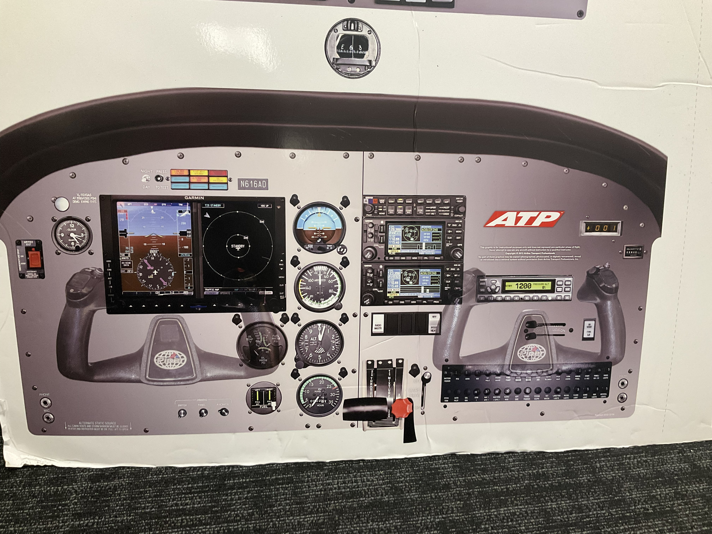

## Emergency Descent — ABCDE

- **A** — Airspeed 115 kts, pwr idle, bank 30–40°
- **B** — Best area to land
- **C** — Checklist
- **D** — Declare emergency 121.5 & 7700
- **E** — ELT on

---

## After Start — Flight Instrument Check

1. Clock ticking with second hand
2. A/S = 0
3. Attitude indicator 0° (<5°), blue over brown
4. Alt = field elevation ±75'
5. HSI = mag compass ±10°
6. VSI = 0
7. Mag compass — no cracks, no bubbles, deviation card present
8. Stby att = 0°
9. A/S = 0
10. Alt within 75' of field elev and within 50' of G500

---

## Taxi — Flight Instrument Check

1. Ball outside of turn, turn coordinator inside
2. HSI/mag compass swing inside of turn
3. Att, VSI = 0

---

## Run Up — Flight Instrument Check

- Set HDG bug to RWY (mag) HDG
- Radio 1/2: Twr/CTAF, Ground/ATIS

---

## Pax Brief

- **Door**: enter top → bottom latch; exit bottom → top latch
- **Emergency exit**: right door, windows x2
- **Seat & seatbelts**: demonstrate adjust seat, put on seatbelt across body and buckle
- **Fire extinguisher**: location, check pointer in green, PASS (Point, Aim, Squeeze, Sweep)
- No smoking
- PIC authority: CFI is PIC
- Positive exchange of flight controls: call, respond, verify, demo

---

## Pre-Maneuver Check — CRAACC

1. Clearing turns
2. Ref point — pick and turn to it
3. Alt — *no lower than 1,500 AGL*
4. A/S
5. Config: cruise / landing / clean
   - **Cruise**: TiT PM — Throttle 2300, engine instruments, tank, pump off, mix lean
   - **Landing/Clean**: PT MF — pump on, tank, mix enrich, flap 0/40
6. Call

---

## Before Landing — PLT MF

1. Pump
2. Landing light
3. Tank
4. Mix full rich
5. Flaps

---

## Steep Turns

- 100 kts
- Cruise checklist
- 45°
- Add 100–200 RPM
- A/S: use PWR (normal command)
- Alt: use pitch

---

## Slow Flight

- 1,500 RPM, landing config (pump, tank, mix, flaps)
- 50–55 kts
- Add power, maintain A/S and alt
- **Recover**: throttle full, flaps 0, Vx, cruise checklist

---

## Power Off Stall

- 1,500 RPM, landing config (pump, tank, mix, flaps)
- Capture 66 kts, descend 123 fpm, pwr idle, pitch up to 20°
- **Recover**: AOA, level, pwr, two notch (straight to 10°), Vx, flaps 0, cruise checklist

---

## Power On Stall

- 1,500 RPM, clean config
- 70 kts
- Full pwr, pitch up to 20°
- **Recover**: AOA, level, pwr, Vx, cruise checklist

---

## Session Notes

**03/18**
- Airport ops: advise twr when runup complete, wait for twr to call while hold short
- Slow flight: holding alt while configuring to enter maneuver <100' loss
- Pwr-on: climb away after achieving 76 kts
- Pwr-off: less nose up after pull power, more realistic sight pic — it will still stall
- Emer desc: use correct checklist first, it may just fix the issue, then ABCDE

**03/19**
- Slow flight: turns no more than 10°; recovery: can't lose alt, slowly lower flaps (prevent alt loss), "full pwr, slow flaps"
- Emergency: checklist, pitch, bank
- Turn around point: CRAACC using clean config & best place to land; 1,000 AGL, 90 kts
- Pump always on before proper tank
- Position report: look at HSI tail, doesn't matter CDI not centered

**03/20**
- PDK turns crosswind 400' prior to TPA (vs. 300' like everywhere else)
- XTK (crosstrack) is 0.6 NM to turn from crosswind to downwind
- At TPA: pitch, pwr, trim (2,000 RPM, 90 kts, 2,000', 1.0 XTK) on downwind, BEFORE LANDING (PLT-MF)
- Abeam touchdown point: 1,500 RPM, 10° flaps, 80 kts, lose 200' and 45° to touchdown point to turn base
- Base: 70 kts, 25° flaps, 0.3 XTK before turning final — **G-CASH** (Glideslope, Config, A/S, Stabilized, Heels)
- Taxi clearance: 21R via B, E cross 16, advise when runup complete
- Traffic pattern scan: "A/S, alt, XTK"
- Climb with right rudder; turns in traffic pattern should be <20°
